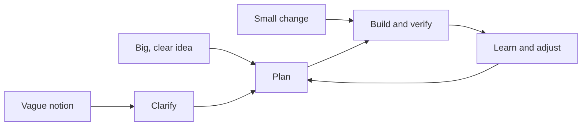
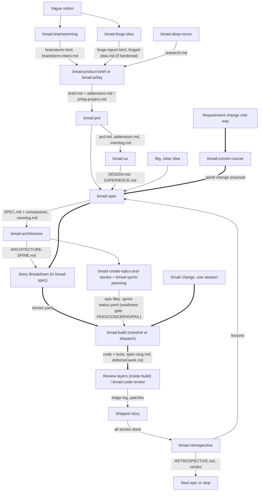

# BMAD — The Flow: How an Idea Moves

*Describes BMAD-METHOD v6.12.0. Tags: [V] traced to primary doc (source IDs in `../sources.md`), [I] inferred, [?] unclear. Nothing here has been run in the lab yet.*

## The one-sentence version

The delivery diagram frames every path as one loop: **Clarify → Plan → Build and verify → Learn and adjust**, entered at three points (vague notion, big clear idea, small change). [V, P10 labels at the v6.12.0 tag] That bigger work "enters the loop earlier and goes round it more often" and "does not become a different way of delivering" is prose from the unreleased clone's `docs/index.md` (P1) and is not in the released docs. [clone-only; not [V] for 6.12.0] The released sizing table (`bmad-build` for one session, `bmad-spec` plus stories for an epic, planning documents for a project, below) supports the same idea. [V, P3]

## Entry points

- A **vague notion** enters at Clarify. A **big, clear idea** enters at Plan. A **small change** enters at Build and verify. "Learn and adjust" loops back to Plan. [I] The labels are in the release diagram; the loop-back arrow was not read and its prose source (P1) is clone-only.
- The diagram file's labels were read; its arrows were not, so the edge structure above is inferred. [I]

## Clarify: get a defined intent

Tools, not stages. Pick what the gap calls for, in any order. None of them build anything. [V, P3]

| The intent is missing | Use |
|---|---|
| A clear idea, or confidence the idea is good | `bmad-brainstorming`, `bmad-forge-idea` |
| Evidence for a decision | `bmad-deep-recon` |
| A written account of the product | `bmad-product-brief` or `bmad-prfaq` |
| Shared decisions several epics/agents must follow | `bmad-architecture`, `bmad-ux` |
| Agreement and sign-off among people | `bmad-prd` |

[V, P3]

A well-defined intent says what should be true when done, what must not change, and what is out of scope, complete enough that someone else could build it without guessing. [V, P3] Where it came from doesn't matter. [V, P3] Idea work ends in a brainstorm intent, a `forged-idea.md`, a session log, or a clearer decision. [V, P4]

A Forge Idea session ends **hardened**, **killed**, or **clearer**, and each is a valid result. [V, P4] "Finding out cheaply that an idea doesn't hold is the win." [V, P4]

## Plan: write the contract

**`bmad-spec` is the hub.** Every epic ends up as a `SPEC.md` that Build reads. [V, P5] Its five fields: Why, Capabilities (each with an intent and a success condition), Constraints, Non-goals, Success signal. [V, P5] It is the only writer of `SPEC.md`; don't hand-edit. [V, P5]

- Input ceiling is roughly a few tens of thousands of tokens (about a 40-page doc). Bigger piles get silently lossy, so condense first. [V, P3, P5]
- Too-thin input ("an app for hikers") is sent to `bmad-prd`. [V, P5]
- The spec "does not help you figure out what you want." [V, P3, P5]

**Size decides the path:** [V, P3]

| Size | Path |
|---|---|
| Trivial edit | Skip BMad; edit directly [V, P3, P8] |
| One session (~500 lines, small handful of files) | `bmad-build` directly [V, P8] |
| Epic (one outcome, several sessions) | `bmad-spec` → Story Breakdown → `stories.yaml` → Build per story → `bmad-retrospective` [V, P3] |
| Project (multi-epic, ~20+ sessions) | Needed planning docs (brief/PRFAQ, PRD, UX, architecture) → `bmad-spec` per epic → epics/stories + sprint planning → Build per story → retrospective per epic [V, P3] |

Extra signals for more planning: high risk, unclear requirements, broad architectural reach, cross-system effects, coordination between people or teams. [V, P3]

**Architecture spine test:** does a decision go in? Only if two units built independently could choose incompatibly, the call is non-obvious, and it's a real trade-off. [V, P6] It exists to prevent things like REST in one epic and GraphQL in another. [V, P6]

**Readiness gate** (`bmad-sprint-planning`): "could a developer implement these epics without inventing decisions nothing records?" Verdict PASS / CONCERNS / FAIL. [V, P7]

**Working modes** on brief, PRD, and UX: a **Fast path** drafts everything with `[ASSUMPTION]` tags; a **Coaching path** draws the thinking out section by section. [V, P5, P6]

## Build and verify: one session per unit

`bmad-build` takes any expression of intent (a sentence, issue, spec, or planned story), investigates the codebase and upstream context, plans, implements, reviews, fixes, and commits locally. [V, P8]

1. Start a **fresh chat** each run. [V, P8]
2. Give it intent, however rough. [V, P8]
3. It resolves intent from evidence; only what the repo can't settle becomes a question. [V, P8]
4. It routes to the smallest safe path using three checks: intent gaps, irreversible actions, footprint. Clean on all three takes the **light path** (minimal spec, implement, review afterward). Anything flagged gets a **full written plan** you approve first. [V, P8]
5. Implement, review with independent reviewers, fix what belongs to this change, defer unrelated pre-existing issues. If the plan or goal was wrong, it regenerates from that layer instead of patching the diff. [V, P8]
6. Summary, then offers PR, walkthrough, or another change. [V, P8]

Each run stays on one goal; extra goals and unrelated findings go to `deferred-work.md`. [V, P8] `bmad-build` handles one unit and does not own the backlog or pick the next story. [V, P8]

**Human attention is called "the most expensive resource," which is the stated reason for the extra review passes.** [V, P8] `bmad-build-auto` runs one unit unattended and is meant for after important decisions are stable. [V, P3, P8]

## Learn and adjust

- **`bmad-retrospective`** reads the epic's evidence (specs, story records, full diff, commits, tracking) and produces a review, action items, and a verdict: `accepted`, `accepted-with-open-items`, or `rejected`. Unfinished stories make it `rejected`. Every finding needs a source reference. It proposes; nothing touches code or specs automatically. [V, P9]
- **`bmad-correct-course`** handles a change too big for one story (a wrong requirement, a changed architecture decision, a changed dependency). It reads the PRD, epics, architecture, and UX documents, assesses impact, and produces a sprint change proposal: what changes, what stays, in what order. Finished work stays finished. [V, P7 at the tag] Afterwards apply the proposal, then re-run Story Breakdown or `bmad-sprint-planning`. [V, P7 at the tag]
  - **What the skill does that the tag's doc does not say (read from `SKILL.md` and `checklist.md` at the tag):** proposals are approved one at a time (Approve / Edit / Skip), then the whole proposal needs an explicit yes, then the change is classified **Minor** (direct implementation by the Developer agent), **Moderate** (backlog reorganization, "Product Owner / Developer"), or **Major** ("Product Manager / Solution Architect", with an escalation notice) and handed off accordingly, and checklist item 6.4 updates `sprint-status.yaml` for added, removed, or renumbered epics and stories. [V, skill files at v6.12.0] The Product Owner and Solution Architect roles named there are not among the five agents. [V, P2 roster; I on the mismatch]
  - **Lab note (Experiment 5, 5b to 5d):** the proposal told the Developer agent to hand-edit `SPEC.md` and `stories.yaml`. Those hand-edits survived small updates but were lost when `SPEC.md` was regenerated from the memlog, because the memlog never recorded them. Routing the change through `bmad-spec` (which logs it) is the durable route. [V-lab; I] **Experiment 5e confirmed it:** with the approved proposal in the planning-artifacts folder, `bmad-spec` picked it up unprompted, logged it, and produced the same spec edits; `stories.yaml` stayed untouched and was flagged stale. [V-lab]
- Story lists are "an execution plan, not a promise that nothing will change." Update the spec and re-run Story Breakdown when earlier work reveals something. [V, P3]
- Dividing work can lose information (a requirement weakens, a constraint disappears, two correct stories fail together). The PRD, architecture, and specs exist so later sessions can still see the whole. [V, P3]

## Inside an organization

When several people must agree, several engineers build in parallel, or someone signs off, planning documents become contracts between people first. [V, P16]

- **The PRD is what the organization owns.** Everything after it is derived; nothing downstream reinterprets it. If a spec needs an answer the PRD doesn't give, the answer goes into the PRD and the spec is re-run. [V, P16]
- **Bring what you have.** An existing PRD (Confluence/Notion), backlog (Jira/Linear), design system, or architecture doc stays. `bmad-prd` can *validate* it (findings report, nothing changed) or *create* from it. Review copies are edited at the source; never hand-edit `prd.md` to catch up. [V, P16]
- **Your tracker stays your tracker.** The skills read and write only `sprint-status.yaml` (story status and action items). **There is no automatic sync with Jira or Linear** in either direction. [V, P16]
- **One owner per document, because each has exactly one writing skill.** Roles: PM (PRD), designer (UX docs), tech lead (architecture spine), one engineer per epic (spec, build, retrospective), whoever tracks the whole (sprint status). [V, P16]
- **Five sign-off moments**, each blocking something specific: PRFAQ verdict (blocks the PRD), PRD validate (blocks design/architecture), architecture spine review (blocks specs), readiness gate (blocks sprint tracking), retrospective verdict (blocks the next epic). [V, P16]
- **Requirement change path:** `bmad-prd` in Update mode (surfaces conflicts first) → update the spine if a cross-epic decision changed → re-run `bmad-spec` for affected epics → re-run Story Breakdown or sprint planning. For a change large enough to threaten the plan, `bmad-correct-course` first. [V, P16]

## Automation and orchestration

`bmad-build-auto` (unattended one-unit worker) plus an orchestrator: `bmad-loop` (a separate optional tool that walks `stories.yaml` in list order as a linear scheduler with no dependency inference) or an AI coding session dispatching one worker per story. Project-level parallel epic streams need a higher coordination layer or separate owners. [V, P15] Guidance: use `bmad-build` yourself for foundational or risky stories first, and hand repetitions to `bmad-build-auto` once the patterns are stable. [V, P3, P8]

## Preview: v7 ticketing (not part of the current flow)

**Not in v6.12.0 (unreleased main; kept for reference).** `bmad-preview-ticketing` and its doc page (P17) exist only in the clone at `f033e70`; neither is at the release tag, and the lab install has no such skill. This section describes unreleased main.

`bmad-preview-ticketing` is a prerelease alternative to `bmad-create-epics-and-stories` plus `bmad-sprint-planning`, organized as initiatives → epics → stories/spikes/bugs in an "initiative store" folder, with optional publishing to GitHub Issues, Jira, Linear, Notion, or Trello (repo markdown is the default and most tested). Its stories are **not read by `bmad-sprint-planning`**, don't appear in `sprint-status.yaml`, and `bmad-build` doesn't update their status yet. Stories start thin and are refined just before building. Trackers only sync when you run the skill; hooks aren't integrated. [V, P17] So this changes the story-tracking stage only if it ships, and only as an alternative. [I]

## Flow diagram: rough idea to shipped story, with what each hand-off leaves

Boxes are skills; labels on arrows are the artifact handed on. Bold-bordered boxes and thick arrows mark the paths run in a lab (Experiments 1 to 5f). Everything else is from the docs and skill files, not run. [V, P3, P5, P6, P7, P8, P9, P16, P19 to P25; V-lab for the marked paths]

**Sizing shortcuts drawn from the docs:** a trivial edit skips BMAD; one session goes straight to `bmad-build`; an epic uses `bmad-spec`, Story Breakdown, then `bmad-build` per story; a project adds brief/PRD/UX/architecture and sprint planning first. [V, P3]

**Paths run in a lab:** small idea to spec to build (Experiment 2); an existing codebase straight to build (Experiment 4); spec to stories to correct-course to spec update to Story Breakdown re-run (Experiments 5 to 5f). Not run: brief, PRFAQ, PRD, UX, architecture, sprint planning, epics, retrospective. [V-lab]

## Artifact trail: what each hand-off leaves behind

| Stage | Artifact |
|---|---|
| Brainstorm | `brainstorm.html`, `brainstorm-intent.md` |
| Forge | `forge-report.html`, `forged-idea.md` |
| Research | `research.md` |
| Brief / PRFAQ | `brief.md` + `addendum.md` / `prfaq-<project>.md` |
| PRD | `prd.md`, `addendum.md`, `.memlog.md` |
| UX | `DESIGN.md`, `EXPERIENCE.md` |
| Spec | `SPEC.md` (+ `stories.yaml` on request) under `specs/spec-<slug>/` |
| Architecture | `ARCHITECTURE-SPINE.md` |
| Epics/stories, tracking | epic files, `sprint-status.yaml` |
| Build | code + implementation record, `deferred-work.md` |
| Close-out | `RETROSPECTIVE.md` or dated retro doc |

All [V, P2, P3, P5, P7, P8, P9]. Exact paths belong to each skill. [V, P5]

## Open questions for the lab

- Does the "light path" vs "full plan" routing behave as described on a toy change? Partly answered: Experiment 2 took the full-plan path (spec `route: dispatch`), and the **installed** `bmad-build` routes on exactly the three checks named in the docs (diff of 2026-09-19, `build-step-by-step.md`). A clean toy taking the light path has not been observed. [V-lab files; ?]
- What does a real `SPEC.md` and `stories.yaml` look like, and how big does a spec get in practice? [?]
- Where does a human actually get pulled in during a `bmad-build` run? [?]

One lab observation so far: `bmad-help` on a tiny idea recommended skipping the planning pipeline and going straight to `bmad-spec` then `bmad-build`, consistent with the sizing rule above. [V-lab, see `lab-log.md`]
